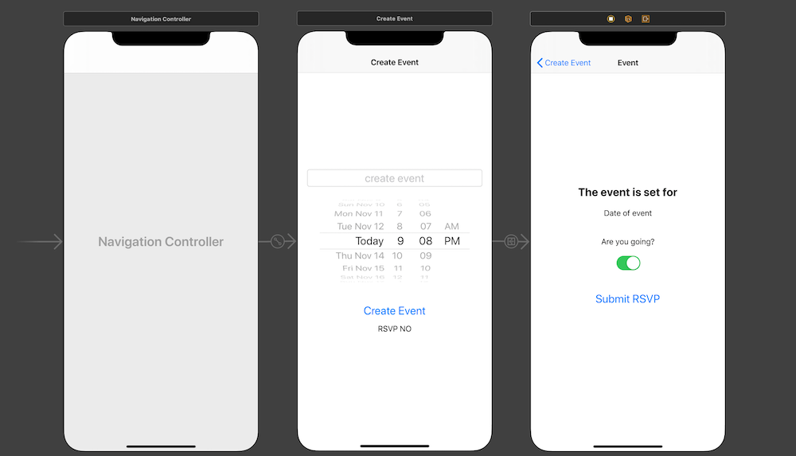

# DatePicker

Using UIDatePicker, Date, DateFormatter and unwind segue to create a Date event app.



## Key Methods 

#### prepare(for segue: ) - passes data from the destination view controller to the source view controller 
```swift 
  override func prepare(for segue: UIStoryboardSegue, sender: Any?) {
    print("prepare(for segue: )")
    
    // here is where we want to setup and pass the event data to
    // the detail view controller
    
    // 1. we need to get an instance of the detail view controller
    // the detail view controller is where we are transitioning to ->
    // segue.source is where the segue is coming from
    // segue.destination is where the segue is going to
    
    //let detailViewController = segue.destination // detailViewController is a UIViewController
    
    guard let detailViewController = segue.destination as? DetailViewController else {
      return
    }
    
    // we could set the event on the detail view controller
    
    // where we segueing to now has its event set successfully
    detailViewController.event = event
  }
```

#### updateUIFromUnwindSegue - unwind segue method, gets data from the source view controller to the destination view controller
```swift
  @IBAction func updateUIFromUnwindSegue(segue: UIStoryboardSegue) {
    // we need access to the source destination view controller
    guard let detailViewController = segue.source as? DetailViewController else {
      return // more on refactoring to fatalError() later
    }
    event = detailViewController.event
    // after event is set here, didSet{....} on the event property gets called
    // and the UI (user interface) is updated
    // ui elements that gets updated are the rsvpLabel's text and createEventButton's titleLabel
  }
```
